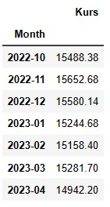
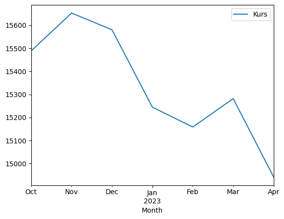

# Capstone Webscrapping using BeautifulSoup

Web scraping is an automatic method to obtain large amounts of data from websites. In this Capstone, I will do web scraping exchange rate US Dollar (USD) To Indonesian Rupiah (IDR) from https://www.exchange-rates.org/history/IDR/USD/T

## Indonesian Rupiah (IDR) per US Dollar (USD)

Through the website, data on the Rupiah to USD exchange rate for a period of 180 days starting from October 10th, 2022 to April 7th, 2023 can be obtained, and a summary graph of the exchange rate movement during that period is generated. It is observed that the Rupiah to USD exchange rate has decreased during the 180-day period, and the average exchange rate during this period is Rp 15,382.

## Data

After scraping, I changed it to a dataframe and I made a groupby based on the month and the average exchange rate for each month

## Plot
After that, we do the visualization

## Conclusion

The chart illustrates that the dollar to rupiah exchange rate has a downward trend from October 2022-April 2023. Although there was an increase in the exchange rate in February 2023, the exchange rate declined again in March-April 2023. The conclusion is that the dollar exchange rate from October 2022 to April 2023 has decreased.

The depreciation of the dollar exchange rate against the rupiah can have several negative impacts. The government should make efforts to keep the rupiah exchange rate stable and strengthen it against the dollar exchange rate.
